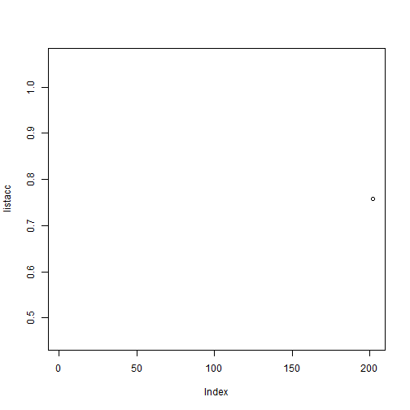

# Titanic Case


```r
train <- read.csv("train.csv")
test <- read.csv("test.csv")
```

Loading Libraries


```r
library(rpart)
library(rpart.plot)
library(caTools)
library(ROCR)
library(caret)
library(e1071)
library(randomForest)
library(flexclust)
```

Formating the Data


```r
train$Survived <- as.factor(train$Survived)
train$Pclass <- as.factor(train$Pclass)
train$Embarked <- as.character(train$Embarked)
#train$Title <- as.factor(train$Title)
test$Pclass <- as.factor(test$Pclass)
test$Embarked <- as.character(test$Embarked)
#test$Title <- as.factor(test$Title)
```


```r
listacc <- NULL
for (i in (202:202)) {
set.seed=202
split <- sample.split(train$Survived, SplitRatio = 0.7)
Titanictrain <- subset(train, split == TRUE)
Titanictest <- subset(train, split == FALSE)
TitanicRF <- randomForest(Survived ~ Pclass + Sex + SibSp + Parch, data = Titanictrain, nodesize = 50, ntree = 2000)
PredictRF <- predict(TitanicRF, newdata = Titanictest)
tabla <- table(Titanictest$Survived, PredictRF)
acc <- (tabla[1,1] + tabla[2,2])/nrow(Titanictest)
#cat("set.seed=",i," acc=",acc,"\n")
listacc[i] <- acc
if (i %% 100 == 0) { cat(i)}
}
acc
```

```
## [1] 0.7574627
```

```r
tabla
```

```
##    PredictRF
##       0   1
##   0 142  23
##   1  42  61
```

```r
plot(listacc)
```

 

```r
max(listacc)
```

```
## [1] NA
```

```r
which.max(listacc)
```

```
## [1] 202
```


```r
PredTest <- predict(TitanicRF, newdata=test, type="response")
MySubmission <- data.frame(PassengerID = test$PassengerId, Survived = PredTest)
write.csv(MySubmission, "Submission.csv", row.names=FALSE)


table(train$Survived, train$Sex)
```

```
##    
##     female male
##   0     81  468
##   1    233  109
```

```r
female <- subset(train, Sex == "female")
table(female$Survived, female$Parch)
```

```
##    
##       0   1   2   3   4   5   6
##   0  41  14  19   1   2   3   1
##   1 153  46  30   3   0   1   0
```

```r
str(train)
```

```
## 'data.frame':	891 obs. of  12 variables:
##  $ PassengerId: int  1 2 3 4 5 6 7 8 9 10 ...
##  $ Survived   : Factor w/ 2 levels "0","1": 1 2 2 2 1 1 1 1 2 2 ...
##  $ Pclass     : Factor w/ 3 levels "1","2","3": 3 1 3 1 3 3 1 3 3 2 ...
##  $ Name       : Factor w/ 891 levels "Abbing, Mr. Anthony",..: 109 191 358 277 16 559 520 629 417 581 ...
##  $ Sex        : Factor w/ 2 levels "female","male": 2 1 1 1 2 2 2 2 1 1 ...
##  $ Age        : num  22 38 26 35 35 NA 54 2 27 14 ...
##  $ SibSp      : int  1 1 0 1 0 0 0 3 0 1 ...
##  $ Parch      : int  0 0 0 0 0 0 0 1 2 0 ...
##  $ Ticket     : Factor w/ 681 levels "110152","110413",..: 524 597 670 50 473 276 86 396 345 133 ...
##  $ Fare       : num  7.25 71.28 7.92 53.1 8.05 ...
##  $ Cabin      : Factor w/ 148 levels "","A10","A14",..: 1 83 1 57 1 1 131 1 1 1 ...
##  $ Embarked   : chr  "S" "C" "S" "S" ...
```

```r
table(train$Parch, train$Survived)
```

```
##    
##       0   1
##   0 445 233
##   1  53  65
##   2  40  40
##   3   2   3
##   4   4   0
##   5   4   1
##   6   1   0
```

```r
summary(TitanicRF)
```

```
##                 Length Class  Mode     
## call               5   -none- call     
## type               1   -none- character
## predicted        623   factor numeric  
## err.rate        6000   -none- numeric  
## confusion          6   -none- numeric  
## votes           1246   matrix numeric  
## oob.times        623   -none- numeric  
## classes            2   -none- character
## importance         4   -none- numeric  
## importanceSD       0   -none- NULL     
## localImportance    0   -none- NULL     
## proximity          0   -none- NULL     
## ntree              1   -none- numeric  
## mtry               1   -none- numeric  
## forest            14   -none- list     
## y                623   factor numeric  
## test               0   -none- NULL     
## inbag              0   -none- NULL     
## terms              3   terms  call
```

```r
table(train$Age)
```

```
## 
## 0.42 0.67 0.75 0.83 0.92    1    2    3    4    5    6    7    8    9   10 
##    1    1    2    2    1    7   10    6   10    4    3    3    4    8    2 
##   11   12   13   14 14.5   15   16   17   18   19   20 20.5   21   22   23 
##    4    1    2    6    1    5   17   13   26   25   15    1   24   27   15 
## 23.5   24 24.5   25   26   27   28 28.5   29   30 30.5   31   32 32.5   33 
##    1   30    1   23   18   18   25    2   20   25    2   17   18    2   15 
##   34 34.5   35   36 36.5   37   38   39   40 40.5   41   42   43   44   45 
##   15    1   18   22    1    6   11   14   13    2    6   13    5    9   12 
## 45.5   46   47   48   49   50   51   52   53   54   55 55.5   56   57   58 
##    2    3    9    9    6   10    7    6    1    8    2    1    4    2    5 
##   59   60   61   62   63   64   65   66   70 70.5   71   74   80 
##    2    4    3    4    2    2    3    1    2    1    2    1    1
```

```r
summary(train$Age)
```

```
##    Min. 1st Qu.  Median    Mean 3rd Qu.    Max.    NA's 
##    0.42   20.12   28.00   29.70   38.00   80.00     177
```


```r
train$Title <- NA
test$Title <- NA

train$Title[grep("Master.", train$Name)] <- "Master."
train$Title[grep("Miss", train$Name)] <- "Miss."
train$Title[grep("Mr.", train$Name)] <- "Mr."
train$Title[grep("Mrs.", train$Name)] <- "Mrs."
train$Title[grep("Rev.", train$Name)] <- "Rev."
train$Title[grep("Don.", train$Name)] <- "Don."
train$Title[grep("Dr.", train$Name)] <- "Dr."
train$Title[grep("Major.", train$Name)] <- "Major."
train$Title[grep("Jonkheer", train$Name)] <- "Jonkheer"
train$Title[grep("Col.", train$Name)] <- "Col."

test$Title[grep("Master.", test$Name)] <- "Master."
test$Title[grep("Miss", test$Name)] <- "Miss."
test$Title[grep("Mr.", test$Name)] <- "Mr."
test$Title[grep("Mrs.", test$Name)] <- "Mrs."
test$Title[grep("Rev.", test$Name)] <- "Rev."
test$Title[grep("Don.", test$Name)] <- "Don."
test$Title[grep("Dr.", test$Name)] <- "Dr."
test$Title[grep("Major.", test$Name)] <- "Major."
test$Title[grep("Jonkheer", test$Name)] <- "Jonkheer"
test$Title[grep("Col.", test$Name)] <- "Col."

table(train$Title, train$Survived)
```

```
##           
##              0   1
##   Col.       7   3
##   Don.       2   0
##   Dr.        5   6
##   Jonkheer   1   0
##   Major.     1   1
##   Master.   17  23
##   Miss.     54 124
##   Mr.      428  81
##   Mrs.      27 100
##   Rev.       6   0
```

```r
table(test$Title)
```

```
## 
##    Col.    Don.     Dr. Master.   Miss.     Mr.    Mrs.    Rev. 
##       5       3       6      20      77     236      69       2
```

```r
table(train$Age, train$Title)
```

```
##       
##        Col. Don. Dr. Jonkheer Major. Master. Miss. Mr. Mrs. Rev.
##   0.42    0    0   0        0      0       1     0   0    0    0
##   0.67    0    0   0        0      0       1     0   0    0    0
##   0.75    0    0   0        0      0       0     2   0    0    0
##   0.83    0    0   0        0      0       2     0   0    0    0
##   0.92    0    0   0        0      0       1     0   0    0    0
##   1       0    0   0        0      0       5     2   0    0    0
##   2       0    0   0        0      0       4     6   0    0    0
##   3       0    0   0        0      0       4     2   0    0    0
##   4       0    0   0        0      0       5     5   0    0    0
##   5       0    0   0        0      0       0     4   0    0    0
##   6       0    0   0        0      0       1     2   0    0    0
##   7       0    0   0        0      0       2     1   0    0    0
##   8       1    0   0        0      0       2     1   0    0    0
##   9       0    0   0        0      0       4     4   0    0    0
##   10      0    0   0        0      0       1     1   0    0    0
##   11      0    0   0        0      0       2     1   1    0    0
##   12      0    0   0        0      0       1     0   0    0    0
##   13      0    0   0        0      0       0     2   0    0    0
##   14      0    0   0        0      0       0     3   2    1    0
##   14.5    0    0   0        0      0       0     1   0    0    0
##   15      0    0   0        0      0       0     3   1    1    0
##   16      0    0   0        0      0       0     6  11    0    0
##   17      0    0   0        0      0       0     4   7    2    0
##   18      0    0   0        0      0       0    10  13    3    0
##   19      0    0   0        0      0       0     4  18    3    0
##   20      0    0   0        0      0       0     2  13    0    0
##   20.5    0    0   0        0      0       0     0   1    0    0
##   21      0    0   0        0      0       0     7  17    0    0
##   22      0    0   0        0      0       0     9  15    3    0
##   23      0    0   1        0      0       0     4   9    1    0
##   23.5    0    0   0        0      0       0     0   1    0    0
##   24      1    0   0        0      0       0     5  13    9    0
##   24.5    0    0   0        0      0       0     0   1    0    0
##   25      0    0   0        0      0       0     3  18    2    0
##   26      0    0   0        0      0       0     3  13    2    0
##   27      0    0   0        0      0       0     3  11    3    1
##   28      1    0   0        0      0       0     2  16    4    1
##   28.5    0    0   0        0      0       0     0   2    0    0
##   29      1    0   0        0      0       0     1  12    6    0
##   30      0    0   0        0      0       0     9  14    2    0
##   30.5    0    0   0        0      0       0     1   1    0    0
##   31      2    0   0        0      0       0     3   9    3    0
##   32      0    0   1        0      0       0     1  14    2    0
##   32.5    0    0   0        0      0       0     1   1    0    0
##   33      0    0   1        0      0       0     1   8    4    0
##   34      0    0   1        0      0       0     1  11    2    0
##   34.5    0    0   0        0      0       0     0   1    0    0
##   35      0    0   0        0      0       0     3  10    5    0
##   36      1    0   1        0      0       0     3  13    4    0
##   36.5    0    0   0        0      0       0     0   1    0    0
##   37      0    0   0        0      0       0     1   5    0    0
##   38      0    0   0        1      0       0     3   5    2    0
##   39      0    0   0        0      0       0     1   8    5    0
##   40      0    1   0        0      0       0     2   6    4    0
##   40.5    0    0   0        0      0       0     0   2    0    0
##   41      0    0   0        0      0       0     1   2    3    0
##   42      0    0   0        0      0       0     1   9    2    1
##   43      0    0   0        0      0       0     0   3    2    0
##   44      0    0   1        0      0       0     0   5    3    0
##   45      0    0   0        0      1       0     1   5    5    0
##   45.5    0    0   0        0      0       0     0   2    0    0
##   46      0    0   0        0      0       0     0   3    0    0
##   47      1    0   0        0      0       0     0   6    2    0
##   48      0    0   0        0      0       0     0   5    4    0
##   49      0    0   1        0      0       0     0   4    1    0
##   50      0    1   1        0      0       0     3   3    2    0
##   51      0    0   0        0      0       0     0   5    1    1
##   52      0    0   0        0      1       0     0   3    2    0
##   53      0    0   0        0      0       0     0   0    1    0
##   54      0    0   1        0      0       0     1   3    2    1
##   55      0    0   0        0      0       0     0   1    1    0
##   55.5    0    0   0        0      0       0     0   1    0    0
##   56      1    0   0        0      0       0     0   2    1    0
##   57      0    0   0        0      0       0     0   0    1    1
##   58      0    0   0        0      0       0     2   2    1    0
##   59      0    0   0        0      0       0     0   2    0    0
##   60      1    0   0        0      0       0     0   2    1    0
##   61      0    0   0        0      0       0     0   3    0    0
##   62      0    0   0        0      0       0     0   3    1    0
##   63      0    0   0        0      0       0     1   0    1    0
##   64      0    0   0        0      0       0     0   2    0    0
##   65      0    0   0        0      0       0     0   3    0    0
##   66      0    0   0        0      0       0     0   1    0    0
##   70      0    0   0        0      0       0     0   1    0    0
##   70.5    0    0   0        0      0       0     0   1    0    0
##   71      0    0   0        0      0       0     0   2    0    0
##   74      0    0   0        0      0       0     0   1    0    0
##   80      0    0   0        0      0       0     0   1    0    0
```

```r
summary(test$Age)      
```

```
##    Min. 1st Qu.  Median    Mean 3rd Qu.    Max.    NA's 
##    0.17   21.00   27.00   30.27   39.00   76.00      86
```

```r
table(train$Title == "Major.")
```

```
## 
## FALSE  TRUE 
##   884     2
```

```r
train[train$Title == "Master.",]
```

```
##      PassengerId Survived Pclass
## 8              8        0      3
## 17            17        0      3
## 51            51        0      3
## 60            60        0      3
## 64            64        0      3
## 66            66        1      3
## 79            79        1      2
## 126          126        1      3
## 160          160        0      3
## 165          165        0      3
## 166          166        1      3
## 172          172        0      3
## 177          177        0      3
## 183          183        0      3
## 184          184        1      2
## 194          194        1      2
## 262          262        1      3
## 279          279        0      3
## 306          306        1      1
## 341          341        1      2
## 349          349        1      3
## NA            NA     <NA>   <NA>
## 387          387        0      3
## 408          408        1      2
## NA.1          NA     <NA>   <NA>
## 446          446        1      1
## 481          481        0      3
## 490          490        1      3
## 550          550        1      2
## NA.2          NA     <NA>   <NA>
## 710          710        1      3
## NA.3          NA     <NA>   <NA>
## 752          752        1      3
## 756          756        1      2
## NA.4          NA     <NA>   <NA>
## 788          788        0      3
## 789          789        1      3
## 803          803        1      1
## 804          804        1      3
## 820          820        0      3
## 825          825        0      3
## 828          828        1      2
## 832          832        1      2
## 851          851        0      3
## 870          870        1      3
##                                                   Name  Sex   Age SibSp
## 8                       Palsson, Master. Gosta Leonard male  2.00     3
## 17                                Rice, Master. Eugene male  2.00     4
## 51                          Panula, Master. Juha Niilo male  7.00     4
## 60                  Goodwin, Master. William Frederick male 11.00     5
## 64                               Skoog, Master. Harald male  4.00     3
## 66                            Moubarek, Master. Gerios male    NA     1
## 79                       Caldwell, Master. Alden Gates male  0.83     0
## 126                       Nicola-Yarred, Master. Elias male 12.00     1
## 160                         Sage, Master. Thomas Henry male    NA     8
## 165                       Panula, Master. Eino Viljami male  1.00     4
## 166    Goldsmith, Master. Frank John William "Frankie" male  9.00     0
## 172                               Rice, Master. Arthur male  4.00     4
## 177                      Lefebre, Master. Henry Forbes male    NA     3
## 183              Asplund, Master. Clarence Gustaf Hugo male  9.00     4
## 184                          Becker, Master. Richard F male  1.00     2
## 194                         Navratil, Master. Michel M male  3.00     1
## 262                  Asplund, Master. Edvin Rojj Felix male  3.00     4
## 279                                 Rice, Master. Eric male  7.00     4
## 306                     Allison, Master. Hudson Trevor male  0.92     1
## 341                     Navratil, Master. Edmond Roger male  2.00     1
## 349             Coutts, Master. William Loch "William" male  3.00     1
## NA                                                <NA> <NA>    NA    NA
## 387                    Goodwin, Master. Sidney Leonard male  1.00     5
## 408                     Richards, Master. William Rowe male  3.00     1
## NA.1                                              <NA> <NA>    NA    NA
## 446                          Dodge, Master. Washington male  4.00     0
## 481                     Goodwin, Master. Harold Victor male  9.00     5
## 490              Coutts, Master. Eden Leslie "Neville" male  9.00     1
## 550                     Davies, Master. John Morgan Jr male  8.00     1
## NA.2                                              <NA> <NA>    NA    NA
## 710  Moubarek, Master. Halim Gonios ("William George") male    NA     1
## NA.3                                              <NA> <NA>    NA    NA
## 752                                Moor, Master. Meier male  6.00     0
## 756                          Hamalainen, Master. Viljo male  0.67     1
## NA.4                                              <NA> <NA>    NA    NA
## 788                          Rice, Master. George Hugh male  8.00     4
## 789                         Dean, Master. Bertram Vere male  1.00     1
## 803                Carter, Master. William Thornton II male 11.00     1
## 804                    Thomas, Master. Assad Alexander male  0.42     0
## 820                       Skoog, Master. Karl Thorsten male 10.00     3
## 825                       Panula, Master. Urho Abraham male  2.00     4
## 828                              Mallet, Master. Andre male  1.00     0
## 832                    Richards, Master. George Sibley male  0.83     1
## 851            Andersson, Master. Sigvard Harald Elias male  4.00     4
## 870                    Johnson, Master. Harold Theodor male  4.00     1
##      Parch          Ticket     Fare   Cabin Embarked   Title
## 8        1          349909  21.0750                S Master.
## 17       1          382652  29.1250                Q Master.
## 51       1         3101295  39.6875                S Master.
## 60       2         CA 2144  46.9000                S Master.
## 64       2          347088  27.9000                S Master.
## 66       1            2661  15.2458                C Master.
## 79       2          248738  29.0000                S Master.
## 126      0            2651  11.2417                C Master.
## 160      2        CA. 2343  69.5500                S Master.
## 165      1         3101295  39.6875                S Master.
## 166      2          363291  20.5250                S Master.
## 172      1          382652  29.1250                Q Master.
## 177      1            4133  25.4667                S Master.
## 183      2          347077  31.3875                S Master.
## 184      1          230136  39.0000      F4        S Master.
## 194      1          230080  26.0000      F2        S Master.
## 262      2          347077  31.3875                S Master.
## 279      1          382652  29.1250                Q Master.
## 306      2          113781 151.5500 C22 C26        S Master.
## 341      1          230080  26.0000      F2        S Master.
## 349      1      C.A. 37671  15.9000                S Master.
## NA      NA            <NA>       NA    <NA>     <NA>    <NA>
## 387      2         CA 2144  46.9000                S Master.
## 408      1           29106  18.7500                S Master.
## NA.1    NA            <NA>       NA    <NA>     <NA>    <NA>
## 446      2           33638  81.8583     A34        S Master.
## 481      2         CA 2144  46.9000                S Master.
## 490      1      C.A. 37671  15.9000                S Master.
## 550      1      C.A. 33112  36.7500                S Master.
## NA.2    NA            <NA>       NA    <NA>     <NA>    <NA>
## 710      1            2661  15.2458                C Master.
## NA.3    NA            <NA>       NA    <NA>     <NA>    <NA>
## 752      1          392096  12.4750    E121        S Master.
## 756      1          250649  14.5000                S Master.
## NA.4    NA            <NA>       NA    <NA>     <NA>    <NA>
## 788      1          382652  29.1250                Q Master.
## 789      2       C.A. 2315  20.5750                S Master.
## 803      2          113760 120.0000 B96 B98        S Master.
## 804      1            2625   8.5167                C Master.
## 820      2          347088  27.9000                S Master.
## 825      1         3101295  39.6875                S Master.
## 828      2 S.C./PARIS 2079  37.0042                C Master.
## 832      1           29106  18.7500                S Master.
## 851      2          347082  31.2750                S Master.
## 870      1          347742  11.1333                S Master.
```

```r
train[is.na(train$Age)  & train$Title == "Master.",] 
```

```
##     PassengerId Survived Pclass
## 66           66        1      3
## 160         160        0      3
## 177         177        0      3
## 710         710        1      3
##                                                  Name  Sex Age SibSp Parch
## 66                           Moubarek, Master. Gerios male  NA     1     1
## 160                        Sage, Master. Thomas Henry male  NA     8     2
## 177                     Lefebre, Master. Henry Forbes male  NA     3     1
## 710 Moubarek, Master. Halim Gonios ("William George") male  NA     1     1
##       Ticket    Fare Cabin Embarked   Title
## 66      2661 15.2458              C Master.
## 160 CA. 2343 69.5500              S Master.
## 177     4133 25.4667              S Master.
## 710     2661 15.2458              C Master.
```


