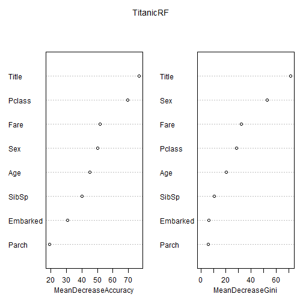

# Titanic: Machine Learning from Disaster

Source: https://www.kaggle.com/c/titanic

Predict survival on the Titanic (using Excel, Python, R, and Random Forests)

See best practice code and explore visualizations of the Titanic dataset on Kaggle Scripts. Submit directly to the competition, no data download or local environment needed!

The sinking of the RMS Titanic is one of the most infamous shipwrecks in history.  On April 15, 1912, during her maiden voyage, the Titanic sank after colliding with an iceberg, killing 1502 out of 2224 passengers and crew. This sensational tragedy shocked the international community and led to better safety regulations for ships.

One of the reasons that the shipwreck led to such loss of life was that there were not enough lifeboats for the passengers and crew. Although there was some element of luck involved in surviving the sinking, some groups of people were more likely to survive than others, such as women, children, and the upper-class.

In this challenge, we ask you to complete the analysis of what sorts of people were likely to survive. In particular, we ask you to apply the tools of machine learning to predict which passengers survived the tragedy.

##VARIABLE DESCRIPTIONS:

survival        Survival
                (0 = No; 1 = Yes)
pclass          Passenger Class
                (1 = 1st; 2 = 2nd; 3 = 3rd)
name            Name
sex             Sex
age             Age
sibsp           Number of Siblings/Spouses Aboard
parch           Number of Parents/Children Aboard
ticket          Ticket Number
fare            Passenger Fare
cabin           Cabin
embarked        Port of Embarkation
                (C = Cherbourg; Q = Queenstown; S = Southampton)

##SPECIAL NOTES:

Pclass is a proxy for socio-economic status (SES)
 1st ~ Upper; 2nd ~ Middle; 3rd ~ Lower

Age is in Years; Fractional if Age less than One (1)
 If the Age is Estimated, it is in the form xx.5

With respect to the family relation variables (i.e. sibsp and parch)
some relations were ignored.  The following are the definitions used
for sibsp and parch.

Sibling:  Brother, Sister, Stepbrother, or Stepsister of Passenger Aboard Titanic
Spouse:   Husband or Wife of Passenger Aboard Titanic (Mistresses and Fiances Ignored)
Parent:   Mother or Father of Passenger Aboard Titanic
Child:    Son, Daughter, Stepson, or Stepdaughter of Passenger Aboard Titanic

Other family relatives excluded from this study include cousins,
nephews/nieces, aunts/uncles, and in-laws.  Some children travelled
only with a nanny, therefore parch=0 for them.  As well, some
travelled with very close friends or neighbors in a village, however,
the definitions do not support such relations.

##We start loading the data sets from Kaggle.


```r
setwd("c:/EMC/Cursos/GitHub/Practice-With-Titanic/")
train <- read.csv("train.csv")
test <- read.csv("test.csv")
```

##Loading Libraries


```r
library(randomForest)
```

```
## Warning: package 'randomForest' was built under R version 3.1.3
```

```
## randomForest 4.6-10
## Type rfNews() to see new features/changes/bug fixes.
```

##Review Data


```r
summary(train)
```

```
##   PassengerId       Survived          Pclass     
##  Min.   :  1.0   Min.   :0.0000   Min.   :1.000  
##  1st Qu.:223.5   1st Qu.:0.0000   1st Qu.:2.000  
##  Median :446.0   Median :0.0000   Median :3.000  
##  Mean   :446.0   Mean   :0.3838   Mean   :2.309  
##  3rd Qu.:668.5   3rd Qu.:1.0000   3rd Qu.:3.000  
##  Max.   :891.0   Max.   :1.0000   Max.   :3.000  
##                                                  
##                                     Name         Sex           Age       
##  Abbing, Mr. Anthony                  :  1   female:314   Min.   : 0.42  
##  Abbott, Mr. Rossmore Edward          :  1   male  :577   1st Qu.:20.12  
##  Abbott, Mrs. Stanton (Rosa Hunt)     :  1                Median :28.00  
##  Abelson, Mr. Samuel                  :  1                Mean   :29.70  
##  Abelson, Mrs. Samuel (Hannah Wizosky):  1                3rd Qu.:38.00  
##  Adahl, Mr. Mauritz Nils Martin       :  1                Max.   :80.00  
##  (Other)                              :885                NA's   :177    
##      SibSp           Parch             Ticket         Fare       
##  Min.   :0.000   Min.   :0.0000   1601    :  7   Min.   :  0.00  
##  1st Qu.:0.000   1st Qu.:0.0000   347082  :  7   1st Qu.:  7.91  
##  Median :0.000   Median :0.0000   CA. 2343:  7   Median : 14.45  
##  Mean   :0.523   Mean   :0.3816   3101295 :  6   Mean   : 32.20  
##  3rd Qu.:1.000   3rd Qu.:0.0000   347088  :  6   3rd Qu.: 31.00  
##  Max.   :8.000   Max.   :6.0000   CA 2144 :  6   Max.   :512.33  
##                                   (Other) :852                   
##          Cabin     Embarked
##             :687    :  2   
##  B96 B98    :  4   C:168   
##  C23 C25 C27:  4   Q: 77   
##  G6         :  4   S:644   
##  C22 C26    :  3           
##  D          :  3           
##  (Other)    :186
```

```r
summary(test)
```

```
##   PassengerId         Pclass     
##  Min.   : 892.0   Min.   :1.000  
##  1st Qu.: 996.2   1st Qu.:1.000  
##  Median :1100.5   Median :3.000  
##  Mean   :1100.5   Mean   :2.266  
##  3rd Qu.:1204.8   3rd Qu.:3.000  
##  Max.   :1309.0   Max.   :3.000  
##                                  
##                                         Name         Sex     
##  Abbott, Master. Eugene Joseph            :  1   female:152  
##  Abelseth, Miss. Karen Marie              :  1   male  :266  
##  Abelseth, Mr. Olaus Jorgensen            :  1               
##  Abrahamsson, Mr. Abraham August Johannes :  1               
##  Abrahim, Mrs. Joseph (Sophie Halaut Easu):  1               
##  Aks, Master. Philip Frank                :  1               
##  (Other)                                  :412               
##       Age            SibSp            Parch             Ticket   
##  Min.   : 0.17   Min.   :0.0000   Min.   :0.0000   PC 17608:  5  
##  1st Qu.:21.00   1st Qu.:0.0000   1st Qu.:0.0000   113503  :  4  
##  Median :27.00   Median :0.0000   Median :0.0000   CA. 2343:  4  
##  Mean   :30.27   Mean   :0.4474   Mean   :0.3923   16966   :  3  
##  3rd Qu.:39.00   3rd Qu.:1.0000   3rd Qu.:0.0000   220845  :  3  
##  Max.   :76.00   Max.   :8.0000   Max.   :9.0000   347077  :  3  
##  NA's   :86                                        (Other) :396  
##       Fare                     Cabin     Embarked
##  Min.   :  0.000                  :327   C:102   
##  1st Qu.:  7.896   B57 B59 B63 B66:  3   Q: 46   
##  Median : 14.454   A34            :  2   S:270   
##  Mean   : 35.627   B45            :  2           
##  3rd Qu.: 31.500   C101           :  2           
##  Max.   :512.329   C116           :  2           
##  NA's   :1         (Other)        : 80
```

##Analizing data

1. Age: We have many missing values on train and test datasets.
2. Fare: We have 1 missing value on test dataset.
3. Embarked: We have 2 observations with "blank" value on train dataset.

##Random Forest

To submit our Prediction, we can use Random Forest with all variables, but we will recive a message error because some of them are imcomplete. So, we need to use only Pclass, Sex, Sibsp and Parch. 


```r
TitanicRF <- randomForest(as.factor(Survived) ~ Pclass + Sex + SibSp + Parch, 
                              data = train, nodesize = 100, ntree = 2444, importance = TRUE)
PredictRF <- predict(TitanicRF, newdata = test)
PredTest <- predict(TitanicRF, newdata=test, type="response")
MySubmission <- data.frame(PassengerID = test$PassengerId, Survived = PredTest)
write.csv(MySubmission, "Submission1.csv", row.names=FALSE)
```

But you will obtain and score of 0.77512 with this submission.

checking importance of variables


```r
varImpPlot(TitanicRF)
```

 

Looks like Pclass and Sex are the most important variables.

To improve a better score, we need to solve those missing values

##Inputting missing Fare value for test dataset

We need to set a guess price (Fare) for this observation.
Investigate about this person to figure out better what was the Fare.


```r
test[which(is.na(test$Fare)), ]
```

```
##     PassengerId Pclass               Name  Sex  Age SibSp Parch Ticket
## 153        1044      3 Storey, Mr. Thomas male 60.5     0     0   3701
##     Fare Cabin Embarked
## 153   NA              S
```

Looking prices for people with the same info.


```r
MissingFare <- median(train[train$Pclass == 3 & train$Embarked == "S" & train$Age > 50 & train$Sex == "male", "Fare"], na.rm = TRUE)
MissingFare
```

```
## [1] 7.75
```

Setting missing Fare with the average of people with the same characteristics.


```r
test[153, "Fare"] <- MissingFare
```

Creating a new Random Forest adding Fare variable.


```r
TitanicRF <- randomForest(as.factor(Survived) ~ Pclass + Sex + SibSp + Parch + Fare, 
                              data = train, nodesize = 50, ntree = 2444, importance = TRUE)
PredictRF <- predict(TitanicRF, newdata = test)
PredTest <- predict(TitanicRF, newdata=test, type="response")
MySubmission <- data.frame(PassengerID = test$PassengerId, Survived = PredTest)
write.csv(MySubmission, "Submission2.csv", row.names=FALSE)
```

We receive 0.78469 with this submission.


```r
varImpPlot(TitanicRF)
```

 

##Inputting Embarked value on train dataset

checking what is the observation with missing Embarked variable


```r
train[train$Embarked == "", ]
```

```
##     PassengerId Survived Pclass                                      Name
## 62           62        1      1                       Icard, Miss. Amelie
## 830         830        1      1 Stone, Mrs. George Nelson (Martha Evelyn)
##        Sex Age SibSp Parch Ticket Fare Cabin Embarked
## 62  female  38     0     0 113572   80   B28         
## 830 female  62     0     0 113572   80   B28
```

Looking similarities


```r
table(train[train$Survived == 1 & train$Pclass == 1, "Embarked"])
```

```
## 
##     C  Q  S 
##  2 59  1 74
```

we can inputting a value "S" (Southampton) because is a mayority.


```r
train$Embarked[c(62,830)] = "S"
train$Embarked <- factor(train$Embarked)
```

train$Embarked <- factor(train$Embarked)


```r
TitanicRF <- randomForest(as.factor(Survived) ~ Pclass + Sex + SibSp + Parch + Fare + Embarked, 
                              data = train, nodesize = 50, ntree = 2444, importance = TRUE)
PredictRF <- predict(TitanicRF, newdata = test)
PredTest <- predict(TitanicRF, newdata=test, type="response")
MySubmission <- data.frame(PassengerID = test$PassengerId, Survived = PredTest)
write.csv(MySubmission, "Submission3.csv", row.names=FALSE)
```

No improvement with Embarked.


```r
varImpPlot(TitanicRF)
```

 

##Trying to solve missing Age info.

If we check some names, we can observe that they have their Title embedded. For example "master"

"Master is an English honorific for boys and young men."

Checking all "masters" in training data.


```r
train[grep("Master.", train$Name, fixed = TRUE), c("Name", "Age")]
```

```
##                                                  Name   Age
## 8                      Palsson, Master. Gosta Leonard  2.00
## 17                               Rice, Master. Eugene  2.00
## 51                         Panula, Master. Juha Niilo  7.00
## 60                 Goodwin, Master. William Frederick 11.00
## 64                              Skoog, Master. Harald  4.00
## 66                           Moubarek, Master. Gerios    NA
## 79                      Caldwell, Master. Alden Gates  0.83
## 126                      Nicola-Yarred, Master. Elias 12.00
## 160                        Sage, Master. Thomas Henry    NA
## 165                      Panula, Master. Eino Viljami  1.00
## 166   Goldsmith, Master. Frank John William "Frankie"  9.00
## 172                              Rice, Master. Arthur  4.00
## 177                     Lefebre, Master. Henry Forbes    NA
## 183             Asplund, Master. Clarence Gustaf Hugo  9.00
## 184                         Becker, Master. Richard F  1.00
## 194                        Navratil, Master. Michel M  3.00
## 262                 Asplund, Master. Edvin Rojj Felix  3.00
## 279                                Rice, Master. Eric  7.00
## 306                    Allison, Master. Hudson Trevor  0.92
## 341                    Navratil, Master. Edmond Roger  2.00
## 349            Coutts, Master. William Loch "William"  3.00
## 387                   Goodwin, Master. Sidney Leonard  1.00
## 408                    Richards, Master. William Rowe  3.00
## 446                         Dodge, Master. Washington  4.00
## 481                    Goodwin, Master. Harold Victor  9.00
## 490             Coutts, Master. Eden Leslie "Neville"  9.00
## 550                    Davies, Master. John Morgan Jr  8.00
## 710 Moubarek, Master. Halim Gonios ("William George")    NA
## 752                               Moor, Master. Meier  6.00
## 756                         Hamalainen, Master. Viljo  0.67
## 788                         Rice, Master. George Hugh  8.00
## 789                        Dean, Master. Bertram Vere  1.00
## 803               Carter, Master. William Thornton II 11.00
## 804                   Thomas, Master. Assad Alexander  0.42
## 820                      Skoog, Master. Karl Thorsten 10.00
## 825                      Panula, Master. Urho Abraham  2.00
## 828                             Mallet, Master. Andre  1.00
## 832                   Richards, Master. George Sibley  0.83
## 851           Andersson, Master. Sigvard Harald Elias  4.00
## 870                   Johnson, Master. Harold Theodor  4.00
```

checking their ages


```r
summary(train$Age[grep("Master.", train$Name, fixed = TRUE)])
```

```
##    Min. 1st Qu.  Median    Mean 3rd Qu.    Max.    NA's 
##   0.420   1.000   3.500   4.574   8.000  12.000       4
```

So, is a good idea setting the Median to those missing values.
And we can use their Title (and other variables) to set those missing values.

To do this, we need to create a new varible and find this characteristic inside the name (Miss, Mrs., Ms., Mme., for example.)

##Creating variable Title

for this case, we need to merge both sets, but considering number of variables.


```r
all_set <- rbind(train[, -2], test)

all_set$Title <- NA
all_set$Alias <- 0

all_set$Title[grep("Master.", all_set$Name, fixed = TRUE)] <- "Master."
all_set$Title[grep("Miss", all_set$Name, fixed = TRUE)] <- "Miss"
all_set$Title[grep("Mr.", all_set$Name, fixed = TRUE)] <- "Mr."
all_set$Title[grep("Mrs.", all_set$Name, fixed = TRUE)] <- "Mrs."
all_set$Title[grep("Rev.", all_set$Name, fixed = TRUE)] <- "Rev."
all_set$Title[grep("Don.", all_set$Name, fixed = TRUE)] <- "Don."
all_set$Title[grep("Dr.", all_set$Name, fixed = TRUE)] <- "Dr."
all_set$Title[grep("Major.", all_set$Name, fixed = TRUE)] <- "Major."
all_set$Title[grep("Jonkheer", all_set$Name, fixed = TRUE)] <- "Jonkheer"
all_set$Title[grep("Col.", all_set$Name, fixed = TRUE)] <- "Col."
all_set$Title[grep("Mme.", all_set$Name, fixed = TRUE)] <- "Mme."
all_set$Title[grep("Ms.", all_set$Name, fixed = TRUE)] <- "Ms."
all_set$Title[grep("Lady.", all_set$Name, fixed = TRUE)] <- "Lady."
all_set$Title[grep("Sir.", all_set$Name, fixed = TRUE)] <- "Sir."
all_set$Title[grep("Mlle.", all_set$Name, fixed = TRUE)] <- "Mlle."
all_set$Title[grep("Capt.", all_set$Name, fixed = TRUE)] <- "Capt."
all_set$Title[grep("the Countess.", all_set$Name, fixed = TRUE)] <- "the Countess"
# Dona is spanish. We need change to Miss.
all_set$Title[grep("Dona.", all_set$Name, fixed = TRUE)] <- "Miss"
all_set$Alias[grep("(", all_set$Name, fixed = TRUE)] <- 1

# Set a factor for this new variable
all_set$Title <- as.factor(all_set$Title)

# Copying Factors to test dataset
levels(test$Title) <- levels(train$Title)
```

#Setting Age variable for missing values


```r
library(rpart)
```

```
## Warning: package 'rpart' was built under R version 3.1.3
```

```r
age_rpart <- rpart(Age ~ Pclass + Sex + SibSp + Parch + Fare + Embarked + Title, data = all_set[!is.na(all_set$Age),], method = "anova")

all_set$Age[is.na(all_set$Age)] <- predict(age_rpart, all_set[is.na(all_set$Age),])
```

##Splitting data sets


```r
train$Age <- all_set[1:891, "Age"]
train$Title <- all_set[1:891, "Title"]
train$Alias <- all_set[1:891, "Alias"]
test <- all_set[892:1309, ]
```

##Creating a new prediction


```r
TitanicRF <- randomForest(as.factor(Survived) ~ Pclass + Sex + SibSp + Parch + Fare + Embarked + Age + Title, 
                              data = train, nodesize = 25, ntree = 2444, importance = TRUE)
PredictRF <- predict(TitanicRF, newdata = test)
PredTest <- predict(TitanicRF, newdata=test, type="response")
MySubmission <- data.frame(PassengerID = test$PassengerId, Survived = PredTest)
write.csv(MySubmission, "Submission4.csv", row.names=FALSE)
```

We receive 0.80383 with this submission.


```r
varImpPlot(TitanicRF)
```

 


